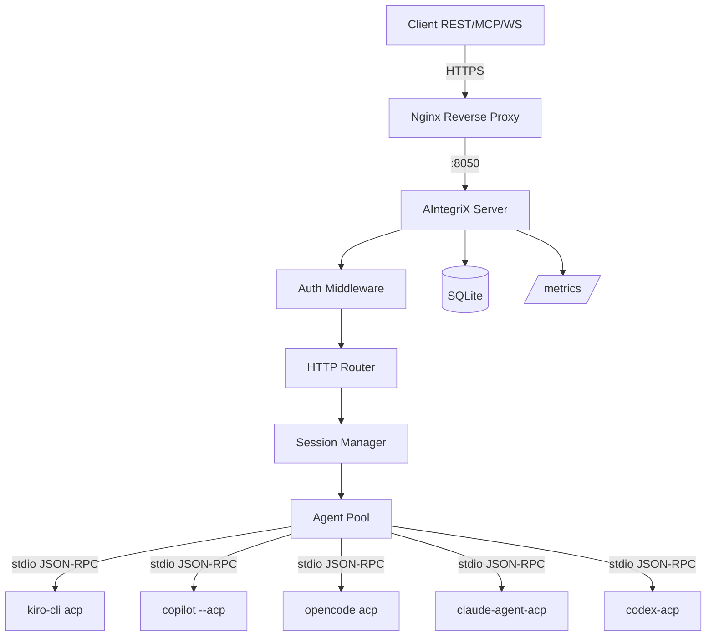
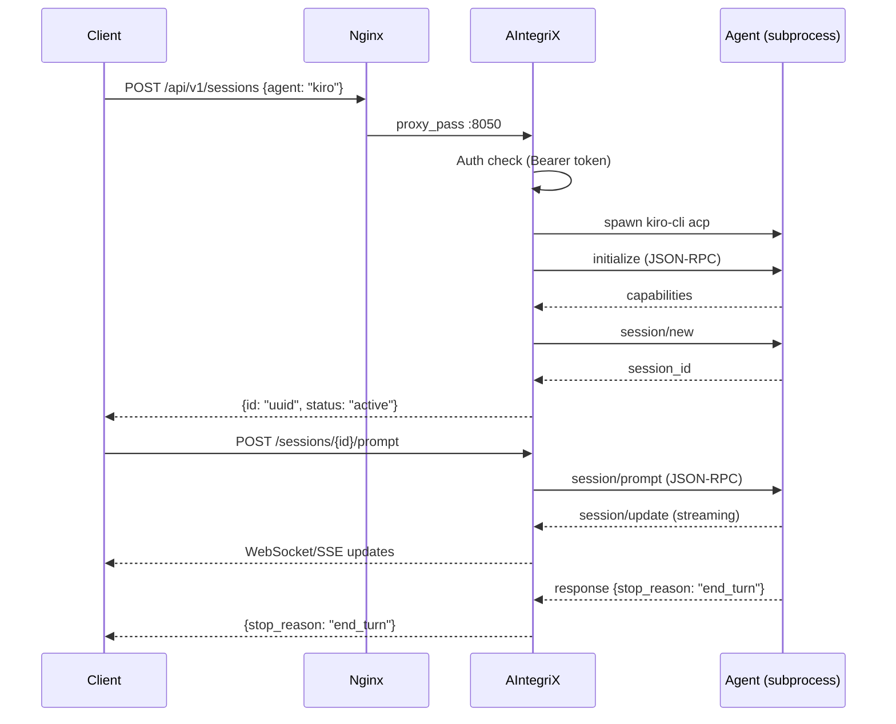
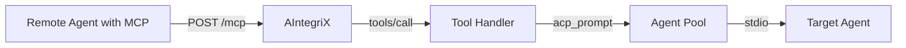

# Diagrams

## System Architecture

```mermaid
graph TB
    Client[Client REST/MCP/WS] -->|HTTPS| Nginx[Nginx Reverse Proxy]
    Nginx -->|:8050| AIntegriX[AIntegriX Server]
    
    AIntegriX --> Auth[Auth Middleware]
    Auth --> Router[HTTP Router]
    Router --> SessionMgr[Session Manager]
    SessionMgr --> AgentPool[Agent Pool]
    
    AgentPool -->|stdio JSON-RPC| Kiro[kiro-cli acp]
    AgentPool -->|stdio JSON-RPC| Copilot[copilot --acp]
    AgentPool -->|stdio JSON-RPC| OpenCode[opencode acp]
    AgentPool -->|stdio JSON-RPC| Claude[claude-agent-acp]
    AgentPool -->|stdio JSON-RPC| Codex[codex-acp]
    
    AIntegriX --> SQLite[(SQLite)]
    AIntegriX --> Metrics[/metrics/]
```

## Request Flow

```mermaid
sequenceDiagram
    participant C as Client
    participant N as Nginx
    participant A as AIntegriX
    participant Ag as Agent (subprocess)

    C->>N: POST /api/v1/sessions {agent: "kiro"}
    N->>A: proxy_pass :8050
    A->>A: Auth check (Bearer token)
    A->>Ag: spawn kiro-cli acp
    A->>Ag: initialize (JSON-RPC)
    Ag-->>A: capabilities
    A->>Ag: session/new
    Ag-->>A: session_id
    A-->>C: {id: "uuid", status: "active"}

    C->>A: POST /sessions/{id}/prompt
    A->>Ag: session/prompt (JSON-RPC)
    Ag-->>A: session/update (streaming)
    A-->>C: WebSocket/SSE updates
    Ag-->>A: response {stop_reason: "end_turn"}
    A-->>C: {stop_reason: "end_turn"}
```

## MCP Integration

```mermaid
graph LR
    RemoteAgent[Remote Agent with MCP] -->|POST /mcp| AIntegriX
    AIntegriX -->|tools/call| Handler[Tool Handler]
    Handler -->|acp_prompt| AgentPool[Agent Pool]
    AgentPool -->|stdio| TargetAgent[Target Agent]
```
