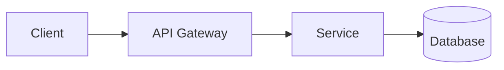
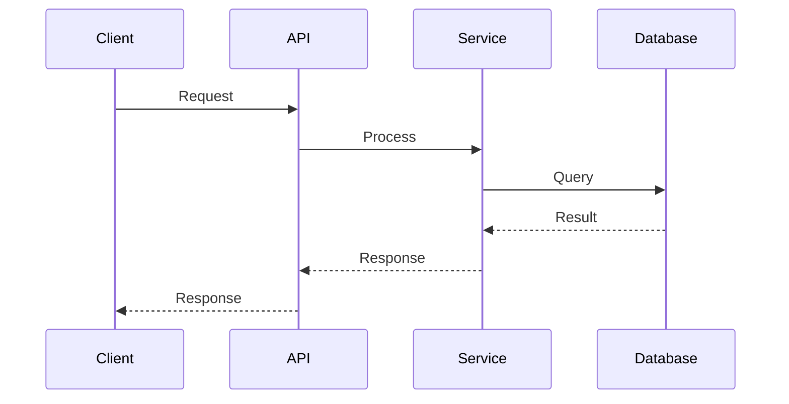
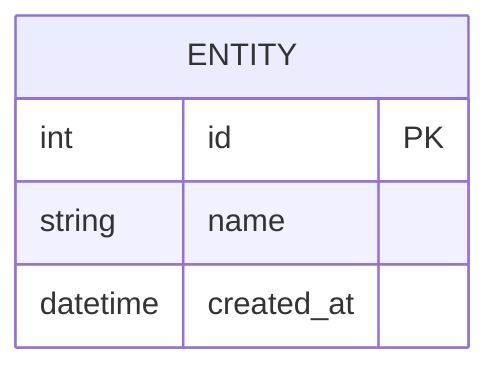
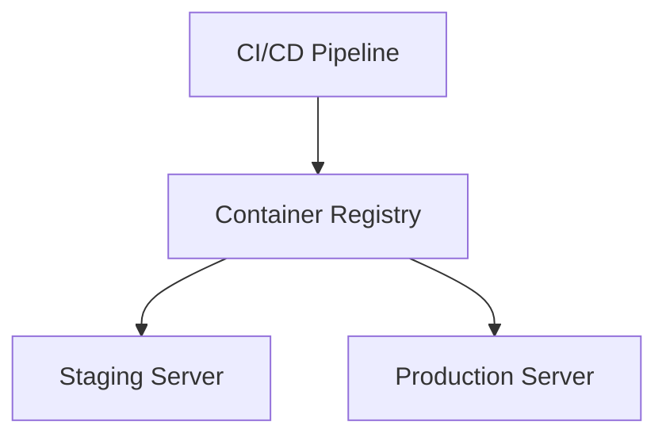

# Diagrams

All Mermaid diagrams for this project. This is the ONLY file where Mermaid blocks are allowed.

## System Overview

```mermaid
graph LR
    Client --> API[API Gateway]
    API --> Service[Service]
    Service --> DB[(Database)]
```

## Sequence: Main Flow

```mermaid
sequenceDiagram
    participant C as Client
    participant A as API
    participant S as Service
    participant D as Database

    C->>A: Request
    A->>S: Process
    S->>D: Query
    D-->>S: Result
    S-->>A: Response
    A-->>C: Response
```

## Entity Relationship

```mermaid
erDiagram
    ENTITY {
        int id PK
        string name
        datetime created_at
    }
```

## Deployment

```mermaid
graph TB
    CI[CI/CD Pipeline] --> Registry[Container Registry]
    Registry --> Staging[Staging Server]
    Registry --> Production[Production Server]
```
